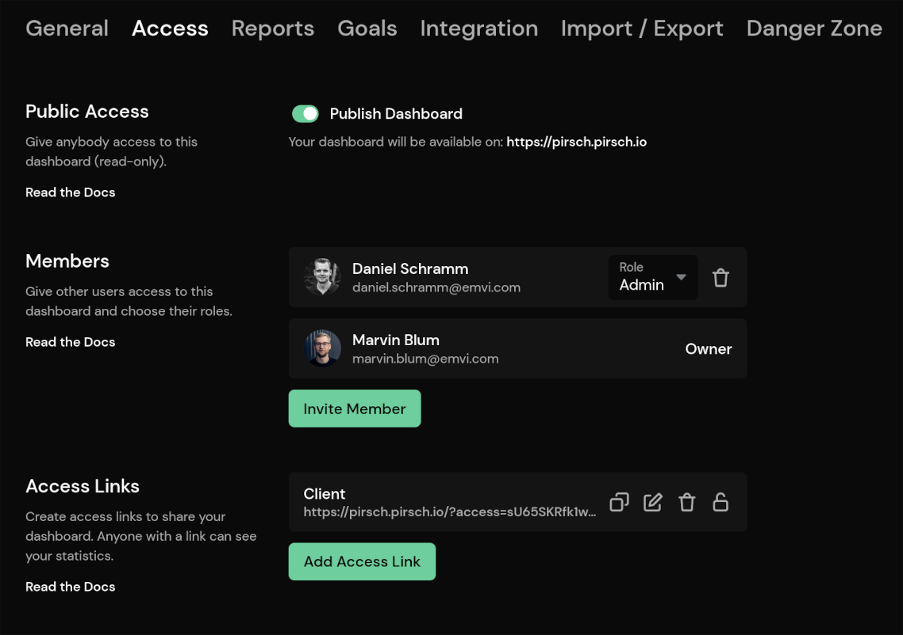

# Access and Permissions

There are several ways to manage access to your site statistics. They always refer to the currently active domain. For example, to give the same person access to two sites, you must add them to both separately.

## Public Access

The *Public Access* and *Access Links* sections both allow anyone to access your dashboard.

*Public Access* makes your dashboard available to anyone on the subdomain you chose when creating the website. An example of this is our live demo on [pirsch.pirsch.io](https://pirsch.pirsch.io/), where the first *pirsch* in the domain is replaced by the one you have configured.

*Access Links* can be used to generate a link that allows anyone who has it to read your dashboard. The advantage over *Public Access* is that you can delete links to deny access without disrupting anyone who has another link.

## Private Access

If you don't want to send out links or make your dashboard public to anyone, you can invite members instead. Click *Invite Member* to add new members to your website and enter all email addresses you would like to invite. The invited members will have to create an account for Pirsch if they don't already have one and accept the invitation.

After the members have joined, they will be able to view all statistics without modifing settings. You can change the member role to give them administrative access to your dashboard, including:

* Managing members (not including themselves or you, the owner)
* Managing access links
* Resetting the identification code
* Managing clients

To remove a member, just click on the trash icon.

