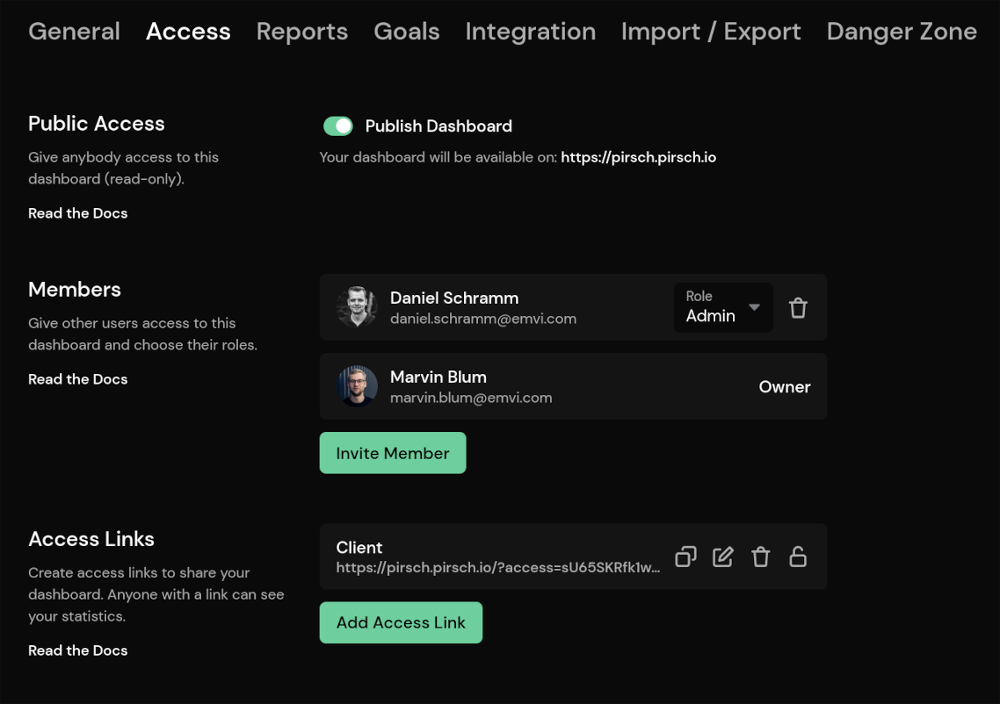

# Embedding the Dashboard

You can embed your dashboard on another website using an iframe, allowing you to display your statistics or integrate them into an application.

## Embedding Your Dashboard

To embed your dashboard, you must first make your dashboard public or create an access link.

Navigate to the access settings page and toggle the **Public Dashboard** option or click **Add Access Link**. If you are creating an access link, choose a name that you will recognize later.



The final step is to add your public dashboard URL or access link to an iframe. Copy the URL/access link and paste it into the `src` attribute of the iframe. The URL will appear below the **Public Dashboard** toggle, the access link will appear once created.

```HTML
<iframe src="http://dev.pirsch.io/?domain=pirsch.io&interval=14d&ui=hide"
    width="1200"
    height="800"
    style="border-width: 0;"></iframe>
```

In this example, we have set the width and height of the iframe and removed the border. The URL has some additional parameters (`?domain=...`). You can copy these from your regular dashboard URL if you want to add filtering options.

## UI Options

There are additional parameters to modify the dashboard UI.

* `ui=hide` will hide the Pirsch header and footer, leaving you with a cleaner dashboard.
* `mode=dark` or `mode=light` sets the dark or light mode for the dashboard. This will override the user's system settings.
