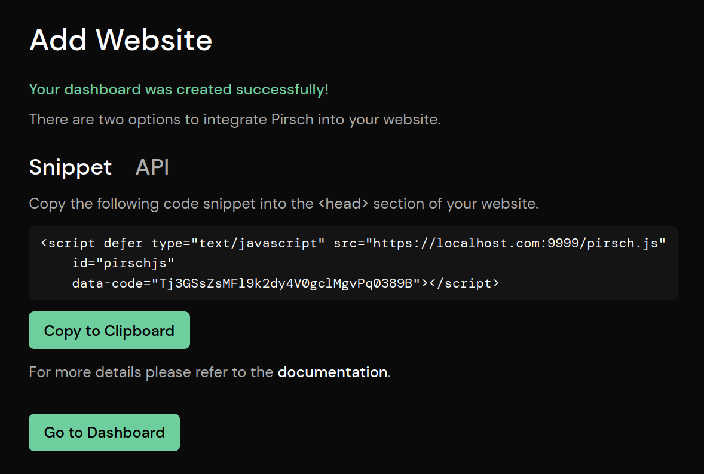

# Website Integration

## Add Pirsch to Your Website

Once you have created an account, you can add Pirsch to your website.

1. Open the dashboard and click on *Add Domain* in the menu.
2. Enter the hostname of your website (like *example.com*) and chose a subdomain and time zone you would like to use for the Pirsch dashboard.
3. Click *Add Domain*.
4. Copy the JavaScript snippet and add it to your website's `<head>` section .

And you're done! Your website will now send page views to Pirsch. Note that only page views for the hostname you have entered will be accepted. A page view for *sub.example.com* won't be accepted if you have configured *example.com*. They are considered entirely different websites and you need to add a new dashboard or [additional domain](/advanced/domains-rollup.md) for them. The only exception for this is `www` in front of your top-level domain. `www.example.com` for example will be accepted for `example.com` and the other way around.

## Testing the Integration

To test the script, navigate to your website and open the network tab of the developer tools in your browser (usually F12 or `Ctrl/Command + Shift + I`). Search for "hit" and make sure you get a 200 response code in the status column.


In case you don't, check your identification code and the domain you have configured. Also, make sure you don't send the *Do Not Track* HTTP header (DNT) or set the `disable_pirsch` option in your local storage as the hit will be ignored then. Adblockers will also block our script.

Should you still not see the request going through, please contact our [support](mailto:support@pirsch.io).

## Resetting the Identification Code

Your website is identified by the hostname the request is made from and an identification code. The identification code must be placed inside the JavaScript snippet. Should you ever need to recreate the code, navigate to the settings page for your website and generate a new one. You'll have to replace the old code afterwards.

```html
<script defer type="text/javascript" src="https://api.pirsch.io/pirsch.js" 
    id="pirschjs" 
    data-code="YOUR_IDENTIFICATION_CODE"></script>
```

## Including or Excluding Pages

The snippet offers a very flexible way to include or exclude pages. You can exclude a single or multiple pages by specifing the `data-exclude` attribute. The content is a list of regular expressions that will be used to filter pages.

```html
<script defer type="text/javascript" src="https://api.pirsch.io/pirsch.js" 
    id="pirschjs" 
    data-code="YOUR_IDENTIFICATION_CODE"
    data-exclude="\/exact\/match,\/exclude\/page\/(en|de)\/.*"></script>
```

This example will match the page `/exact/match` and every page the starts with `/exclude/page/en/` or `/exclude/page/de/`.

Please always [validate](https://regex101.com/) your expressions before using them and make sure you don't see any errors on the browser console. Special regex characters need to be masked. For a simple single page filter use a pattern like `\/your\/page`.

`data-include` can be used to whitelist pages. In the case of whitelisting, only pages that match a pattern in the list will send a page view. The blacklist still applies afterwards.

## Disabling Certain Features

It's possible to disable certain features of the script. Disabling a feature will prevent the data from being sent to Pirsch. To disable a feature, simply add an attribute to the script tag.

* `data-disable-query` removes all query parameters from the URL, including UTM parameters
* `data-disable-referrer` removes the referrer
* `data-disable-resolution` removes the screen resolution (width and height)

Here is an example:

```html
<script defer type="text/javascript" src="https://api.pirsch.io/pirsch.js" 
    id="pirschjs" 
    data-code="YOUR_IDENTIFICATION_CODE"
    data-disable-query></script>
```

## Creating Rollup Views and Sending Data to Multiple Dashboards

It's possible to create rollup-views and to send data to multiple dashboards. Please read the [developer settings article](/settings/developer.md#additional-domains) for details.

## Ignoring Your Own Page Views

You can disable the integration by setting the DNT (Do Not Track) header to `1` in your browser or by adding a value called `disable_pirsch` to your local storage.

For the latter option, open the developer tools (usually F12 or `Ctrl/Control + Shift + I`) in your browser and navigate to the *web storage* tab. Click on *local storage* and add a new value `disable_pirsch` and `1` as value. After reloading the page, no page view or event (in case you also use the event script) should be sent to Pirsch.

## Testing on Localhost

The scripts ignore any requests created on localhost. In case you would like to overwrite this behavior, like for testing, you can add the `data-dev` attribute. The hostnames need to match. If you test on localhost, rewrite the hostname using the `data-dev` attribute like this:

```html
<script defer type="text/javascript" src="https://api.pirsch.io/pirsch.js" 
    id="pirschjs" 
    data-code="YOUR_IDENTIFICATION_CODE"
    data-dev="example.com"></script>
```

In this case, the hostname you've configured on the dashboard is `example.com`. So you need to add `data-dev="example.com"` to rewrite the hostname.
